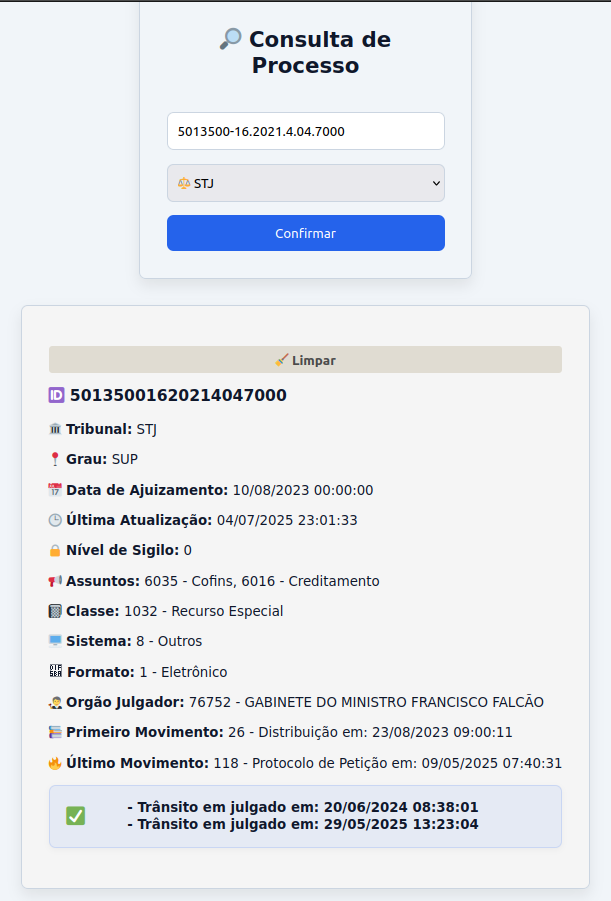

# transitojudicial

Aplicação web para autenticação simples e consulta de processos judiciais diretamente na API pública do **DATAJUD/CNJ**.

## Ambiente para testes e demonstrações 
>As seguintes 2 credenciais para usuário/senha neste ambiente: teste/teste ou admin/admin):
https://jrhumberto.github.io/transitojudicial/

## Contexto de negócio

Um importante problema quando se estuda Jurimetria é saber a razoável duração de um processo. Por isso, é relevante compreender o marco do "Trânsito em Julgado" como seu ponto de finalização. No entanto, alguns processos tem características peculiares que podem necessitar de mais de um marco, por isso esta aplicação vem no interesse de ofertar uma visão sintética que esclarece se um processo teve mais de um "Trânsito em julgado"

A consulta em tribunais é um processo demasiadamente mecânico, com cada Egrégia com seu sistema de consulta. Um importante sintoma dessa difuiculdade é ofertar aos advogados um local para consultar processos e a API do Conselho Nacional de Justiça do DATAJUD veio para facilitar este acesso.

Dessa forma, nossa aplicação realiza consultas nesta API e oferta um resultado que pode indicar se uma lide teve ou não "trânsito em julgado" ou se mais de um marco assim e suas datas de movimentação processual.

Exemplo de saída interessante de nossa aplicação:

<p align="center">
  
</p>


## Visão geral da Aplicação

Este projeto oferece uma interface web para:

- realizar login com credenciais autorizadas;
- alternar entre tema claro e escuro;
- consultar um processo pelo número único do processo (NUP);
- exibir informações resumidas do processo retornadas pela API do DATAJUD e consultar se ele tem a **peculiaridade de duplo "trânsito em julgado"**.

A aplicação é composta por páginas estáticas em HTML, CSS e JavaScript.

## Funcionalidades

- **Login restrito**
  - autenticação baseada em credenciais definidas em `env.js` (não é boa prática deixar credenciais expostas);
  - redirecionamento após login;
  - expiração da sessão após 30 minutos.

- **Consulta de processo**
  - pesquisa por número único do processo;
  - seleção do tribunal;
  - exibição de dados como:
    - tribunal;
    - grau;
    - data de ajuizamento;
    - última atualização;
    - nível de sigilo;
    - assuntos;
    - classe;
    - sistema;
    - formato;
    - órgão julgador;
    - primeiro e último movimento;
    - ocorrência relacionada a julgamento.
    - checagem se houve um ou mais de um "trânsitado em julgado"

- **Tema claro/escuro**
  - persistência da preferência no `localStorage`.

- **Design responsivo**
  - interface adaptada para telas menores.

## Estrutura do projeto

```bash
.
├── index.html
├── login.html
├── home.html
├── datajud.html
├── script.js
├── styles.css
├── README.md
└── .github/
```

## Utilização da página

### Acessar a aplicação
    * Abra index.html ou a URL do projeto (pode ser o link do ambiente de testes e demonstração ).
    * Faça login com uma credencial válida.
    * Escolha o destino:
        - Home
        - Datajud (escolha essa opção se quiser consultar um processo)

### Consultar um processo
    * Digite o número único do processo (pode ser com pontos e barras).
    * Selecione o tribunal.
    * Clique em Confirmar.
    * Aguarde o retorno da consulta.


### Tribunais suportados
    - STJ
    - TJCE
    - TJSP
    - TRF1
    - TRF2
    - TRF3
    - TRF4
    - TRF5
    - TRF6

### Importante: Há dependência de disponibilidade da API do DATAJUD que é mantida pelo CNJ.


## Boas práticas recomendadas para versões futuras e backlog de segurança da página
    [ ] mover credenciais e tokens para backend;
    [ ] remover dependência de env.js no front-end;
    [ ] validar melhor a entrada do número do processo;
    [ ] tratar cenários em que movimentos ou assuntos estejam ausentes;
    [ ] adicionar loading state mais robusto;
    [ ] incluir testes para parseData;
    [ ] adicionar tratamento de erro específico para falhas de CORS e API.
    [ ] usar autenticação real no backend;
    [ ] evitar expor token da API no navegador;
    [ ] implementar rate limiting e logs de auditoria.

## Limitações
    - autenticação é apenas client-side;
    - depende de env.js;
    - a consulta pode falhar se o proxy CORS estiver indisponível;
    - o formato dos dados depende da resposta da API do DATAJUD.

## Tecnologias utilizadas
    - HTML5
    - CSS3
    - JavaScript
    - API pública do DATAJUD/CNJ


## Prompt inicial
```bash
I want a web page where I can enter a case number and have it track or show the status of a case directly from the DATAJUD API in Brazil. It should have a simple interface to log in, go to a home screen, and then allow searching or tracking a judicial process. The site should connect to the DATAJUD API and display useful information from it without me needing to handle technical details. Please use modern, user-friendly design and make sure everything works smoothly. If you need more details on how the API works, just look up the latest DATAJUD API docs online.
```

## Licença
Apache-2.0

## Referência

Documentação oficial da API pública do DATAJUD:
https://datajud-wiki.cnj.jus.br/api-publica/endpoints

